# I Think Therefore I Drink [Think-Drink] - A cocktail recipe site for whisky and whiskey drinkers

## Author
Benjamin Norman

## Project Overview
The Think-Drink project is a repository for recipes for whisky [scotch] and whiskey [bourbon] cocktails. Users can browse recipes, search by ingredient and submit their own cocktails for approval by the admin. 

Designed within an AGILE framework, The site has full CRUD functionality for Users and Admins. 

You can view the deployed website here:  

https://i-think-therefore-i-drink-44cd107f3be4.herokuapp.com/

// https://ui.dev/amiresponsive <- make a sample image

- [I Think Therefore I Drink](#i-think-therefore-i-drink---a-whisky-whiskey-cocktail-recipe-site-for-drinkers)
  * [Author](#author)
  * [Project Overview](#project-overview)
- [UX](#ux)
  * [Project Goal](#project-goal)
  * [User Stories](#user-stories)
- [Design Choices](#design-choices)
  * [Colours](#colours)
  * [Typography](#typography)
  * [Images/Icons](#images-icons)
  * [Responsiveness](#responsiveness)
- [Wireframes](#wireframes)
  * [Home page](#home-page)
  * [Post Detail](#post-detail)
  * [User Favourites page](#user-favourites-page)
- [Features/Structure](#features-structure)
  * [Navigation](#navigation)
  * [Messages](#messages)
  * [Header/Navbar](#header-navbar)
  * [Cocktail Cards](#cocktail-cards)
  * [Update](#update)
  * [Delete](#delete)
  * [Footer](#footer)
  * [Error 404/403/500 Pages](#error-404-403-500-pages)
  * [Features for Future Development](#features-for-future-development)
- [Data Model](#data-model)
- [CRUD](#crud)
- [Testing](#testing)
- [Technologies Used](#technologies-used)
  * [Languages](#languages)
  * [Database](#database)
  * [Frameworks](#frameworks)
  * [Media hosting](#media-hosting)
  * [Libraries/Packages](#libraries-packages)
  * [Other](#other)
- [Deployment](#deployment)
  * [ElephantSQL](##elephantsql)
  * [Cloudinary](##cloudinary)
  * [Heroku](##heroku)
  * [GitHub/GitPod](##github-gitpod)
- [Credits](#credits)
  * [Media](#media)
- [Acknowledgements](#acknowledgements)

<small><i><a href='http://ecotrust-canada.github.io/markdown-toc/'>Table of contents generated with markdown-toc</a></i></small>

# UX
## Project Goal
My aim was create a repository of recipes for whisky/whiskey-cocktail fans, where users can not only get ideas for cocktails but also add to the site, increasing site interaction and user satisfaction.

## User Stories
For Administrator:
- As a Site Admin I can create draft posts so that I can finish writing the content later
- As a Site Admin I can approve submitted cocktail recipes so that the site can grow with user input
- As a Site Admin I can create, read, update and delete recipes so that I can manage my site content

For Site User:
- As a Site User I can register an account so that I can favourite recipes
- As a Site User I can delete any of my own cocktail submissions so that I can remove any submissions I no longer want to share
- As a Site User I can apply to update the cocktails I've had approved so that I have control over what I have submitted
- As a Site User I can filter cocktails by whisky/whiskey so that I can find a cocktail that suits me
- As a Site User I can search cocktails by ingredient so that I can find a cocktail I'd like to drink
- As a Site User I can submit cocktail recipes so that the site content can be improved
- As a Site User I can register an account so that I can favourite recipes
- As a Site User I can favourite and unfavourite a recipe so that I can interact with the content
- As a Site User I can view the number of favourites on each recipe so that I can see which is the most popular
- As a Site User I can view a list of recipes so that I can select one to read
- As a Site User I can click on a recipe so that I can read the full text
- As a Site User I can see how many steps are required to make each cocktail so that I can assess the relative difficulty level of making each cocktail

# Design Choices
## Colours
I wanted to keep a clean and simple look for the colours reminiscent of a whisky bar, so stuck mainly with shades between light grey and very dark grey, with flashes of colour in the site icon [orange] and card backgrounds [light-red, light-green]. The background has a linear colour-shift from dark-grey to light-grey and back again, remininscent of burnished metal. The cocktail images also add appropriate colour to the site.

I chose to keep buttons either light or dark (though I darkened basic Bootstrap btn-light class) to keep the theme consistent, the exceptions being the delete-confirmation button, as this performs a fairly major action that cannot be reversed, and the log out button (both a light orange colour, adapted from the btn-warning Bootstrap class). The Admin buttons in each post detail page are green, to delineate them from the regular page and buttons.

// add swatch 

## Typography
I left the typography as the basic Bootstrap typeface (Open Sans) as I felt it had the simple style I was after.

// django fonts? should I change any fonts..?

## Images/Icons
- All cocktail images were chosen by me to represent each cocktail.  
- The site icon showing a whisky bottle and glass gives a clear impression of the purpose of the site.  
  
- The banner gives the site name and again is reminiscent of a classic whisky bar.  
  
- The 'favourite' icon is a whisky glass, which fits the theme of the site.  
  
- The 'steps' icon is a man taking steps (well, walking), indicating the number of steps needed to make each cocktail.  
 

## Responsiveness
The site was designed with Bootstrap 5 to be fully responsive at all screen sizes within reason.

# Wireframes
## Home page
I originally envisaged the blurb to be separate from the main list of recipes, though ended up combining the 2 by adding the blurb at the top of the recipe list. I also did not originally have cocktail images in the recipe list, but realised it would make the site look *far* better. My original wireframes are presented here.   
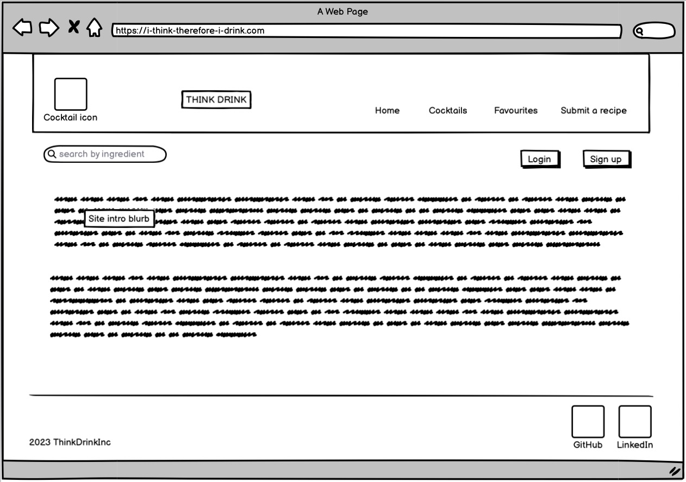 
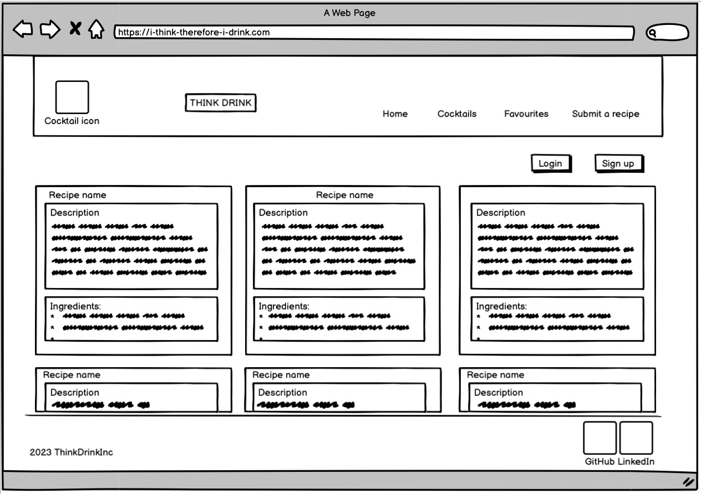  
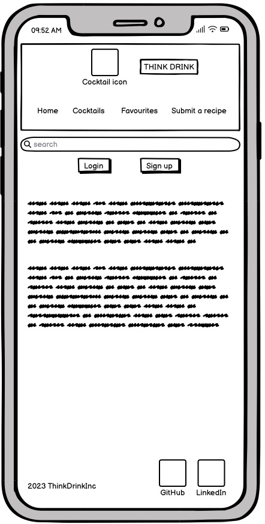 
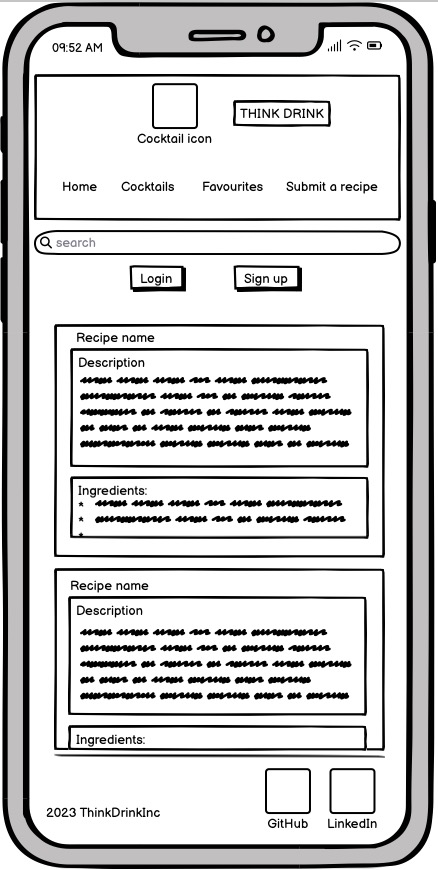   

## Post Detail
The post detail page did not change much from my initial plan.
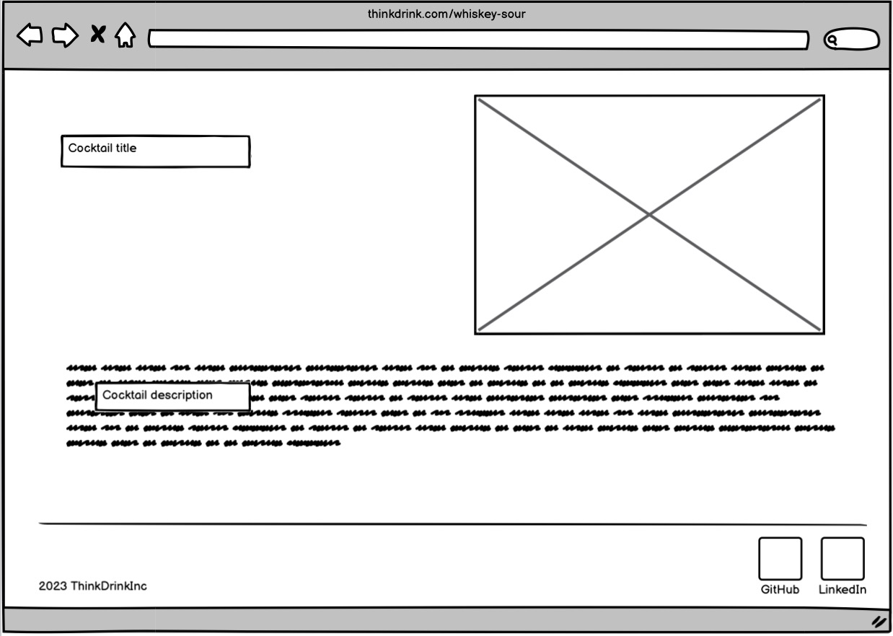 
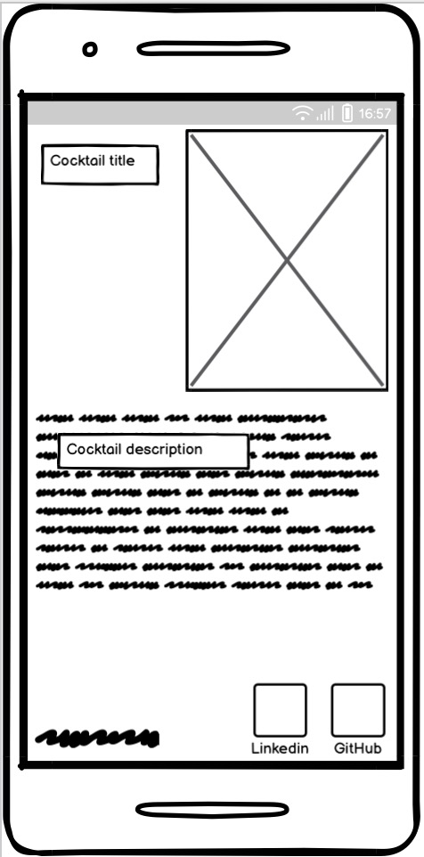 

## User Favourites page
The user favourites page was always envisioned to be the same as the recipe list page, so I did not create a separate wireframe for it. 

// more wireframes to add..?

# Features/Structure
## Navigation
The user initially lands on the homepage. From here they can sign-up, log-in, or simply browse the homepage and each of the post-detail pages. Clicking on the **Favourites** or **Submit a recipe** buttons will redirect to the log-in page. They can also search by ingredient for cocktails.

Logged-in users can further favourite and unfavourite cocktails (a message will appear onscreen telling them this has been successful) and submit their own cocktail recipes to be approved by the admin. Favouriting/unfavouriting can be done through the homepage or search results page, and unfavouriting from the user's personal Favourites page.

Once their cocktails appear on the homepage they can edit their own cocktails (but not those of other users) or delete them from the database. 

Users can always return to the homepage by clicking on the icon or banner at the top of the page, the icon in the footer, besides the **Home** button in the navbar (consistent with most modern websites).

To keep the site stylistically sound, the admin is the only one who can approve cocktails submitted, and the admin also chooses the image for each cocktail (a default image will show if no image is specifically chosen by the admin). 

## Messages
Messages appear upon most actions undertaken, such as signing in or out, favouriting/unfavouriting a cocktail, when a search returns no results, or when a cocktail is successfully updated.  
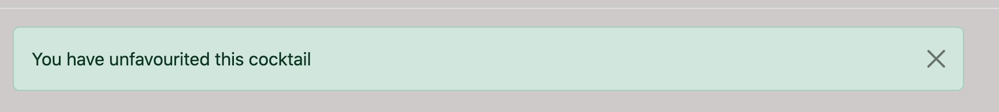 

## Header/Navbar
The header contains a clickable icon and banner (both of which redirect to the homepage) plus a **Home** button (likewise), a **Favourites** button which redirects to the user's list of favourited cocktails, and a **Submit a cocktail** button which redirects to a submission form. 

Beneath the navbar is a **Search by ingredient** search bar, and buttons to log in, log out and/or sign up, depending on the logged-in state of the user.

## Cocktail Cards
Users can see how many steps [i.e. instructions] are required to make each cocktail, and favourite a cocktail from the relevant card, or click into each card to show the ingredients and instructions.

## Update
Users can update any of their published cocktails linked from the Post Detail page, but not those of other users.

## Delete
Users can delete any of their published cocktails linked from the Post Detail page, but not those of other users.

## Footer
The footer contains 3 clickable items: the site icon (which redirects to the homepage), plus 2 social media icons which redirect to the author's Linkedin and GitHub pages. 

## Error 404/403/500 Pages
Error pages for 404, 403 and 500 are included.

## Features for Future Development
There are two main features I'd like to include in future: live search and approval for updates.

To add a search function that updates as you type would involve the addition of some JavaScript to the search functionality. I did not include this for lack of time.

Currently when a user updates one of his/her cocktail recipes it is not sent to the Admin for approval. This is a feature I would like to add to prevent abuse of the site, though could not find a way to include in in my current site iteration.

Other useful future additions could be rating system for cocktails where users could rate cocktails on a 1-5 star scale, and an option to list cocktails in order of rating, highest to lowest. 

# Data Model
// Erk! Have not made anything for this yet. 

# CRUD
CRUD is fully available for both users and the admin.

- For users, they can **Create** cocktail recipes, **Read** the posts on the site, **Update** recipes they've contributed to the site and **Delete** their submissions from the site.

- Admin users can also **Create** draft posts to be edited and published later, **Read** user submissions prior to approval, **Update** the posts of any user through the admin panel, and likewise **Delete** any post they see fit. There are also buttons on each post detail page providing direct links to the admin panel for updates and deletions for added ease of use.

# Testing
// LOADS to do here

# Technologies Used
## Languages
- HTML, CSS, Python, and a tiny bit of JavaScript

## Database
- ElephantSQL

## Frameworks
- Django, Bootstrap

## Media hosting
- Cloudinary

## Libraries/Packages
- Django allauth
- Django Crispy Forms
- Summernote
- Gunicorn
- Psycopg2

## Other
- [Flaticon](https://www.flaticon.com/)
- [Balsamiq Wireframes](https://balsamiq.com/)
- [Font Awesome](https://fontawesome.com/)
- [CSS Gradient](https://cssgradient.io/)

# Deployment
## ElephantSQL
1. Create a free account on ElephantSQL, access the dashboard and create a new instance (input a name, choose Tiny Turtle plan, select a region).
2. Access to the dashcoard and copy the database URL.

## Cloudinary
1. Create an account on Cloudinary.
2. Follow the instructions to create a media hosting account (free level).
3. Copy the Cloudinary database URL.

## Heroku
1. Create a new app in Heroku, choose a unique name and region.
2. Go to settings and add a new config var of DATABASE_URLpython with the value of the URL from ElephantSQL.
3. Add host name of the Heroku app name to ALLOWED HOSTS in settings.py:

`ALLOWED_HOSTS = ['{heroku deployed site URL here}', 'localhost' ]`

## GitHub/GitPod
1. Create a new repository on GitHub, open a new workspace with GitPod.
2. Install django pip3 install django==3.2.3.
3. Create a new project within Django.
4. Run migrations, create an admin super-user.
5. Install  `pip3 install dj_database_url==0.5.0 psycopg2` and freeze requirements  pip freeze > requirements.txt
6. Add  `import os` and import `dj_database_url` to settings.py
7. To connect the new database, paste in the ElephantSQL URL copied earlier.

`DATABASES = {
     'default': dj_database_url.parse(os.environ.get("DATABASE_URL"))
 }`

8. To ensure connection to the external database, run `python3 manage.py makemigrations` then run `python3 manage.py migrate`
9. Install pip3 install gunicorn and run  pip freeze > requirements.txt
10. Create a Procfile in the root directory and include web: gunicorn project_name.wsgi:applications
11. Generate a SECRET_KEY, add it to Heroku config vars.
12. Create env.py file and include it in the .gitignore file, and add the SECRET_KEY, Cloudinary URL and ElephantSQL DATABASE_URL to environment variables:

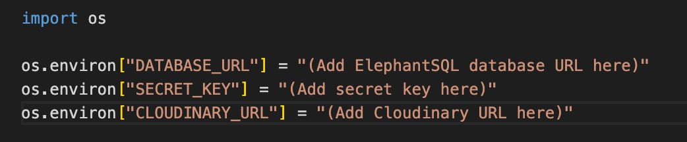

13. Add the below to settings.py:

`SECRET_KEY = os.environ.get('SECRET_KEY', ' ')`
`DEBUG = 'DEVELOPMENT' in os.environ`

14. Commit and push to GitHub.
15. In Heroku, add `DISABLE_COLLECT_STATIC = 1` to Heroku config vars.
16. Connect the project to the GitHub repository using personal account login.
17. Add Cloudinary URL variable to the Heroku config vars:

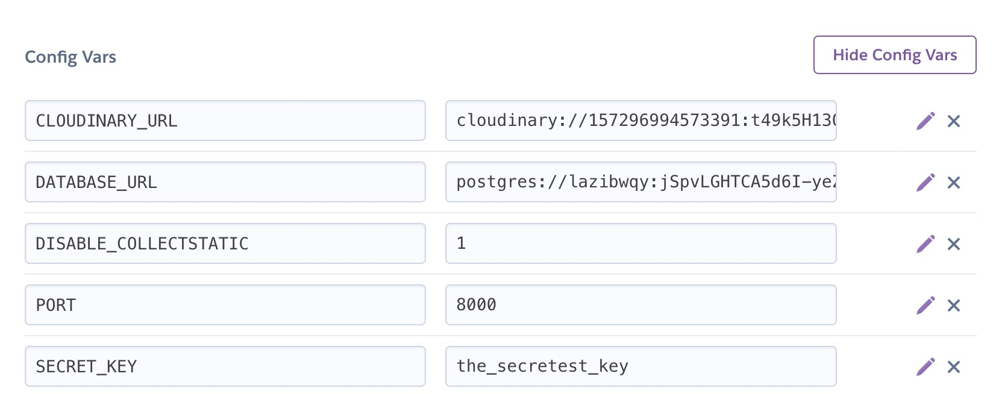

18. Add Cloudinary to installed apps in settings.py, add static/media file settings:

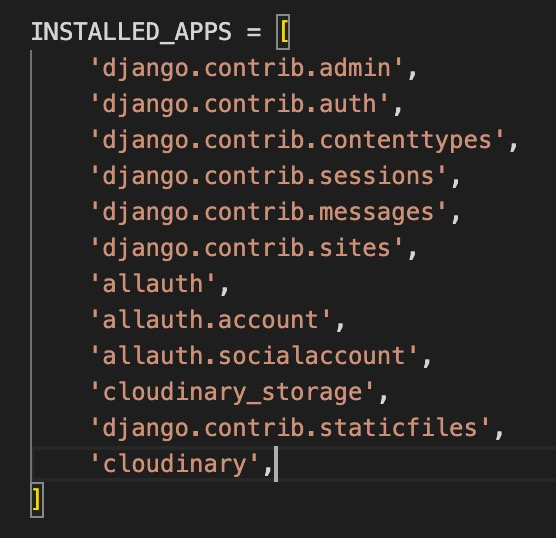
(note - some extra installations are shown in this screenshot that are not essential for deployment)

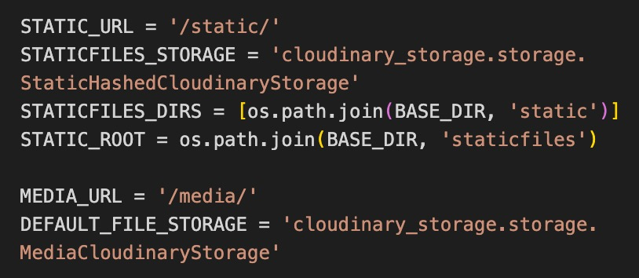

19. Add template directories in settings.py, add Heroku host name to allowed hosts and add directory files:

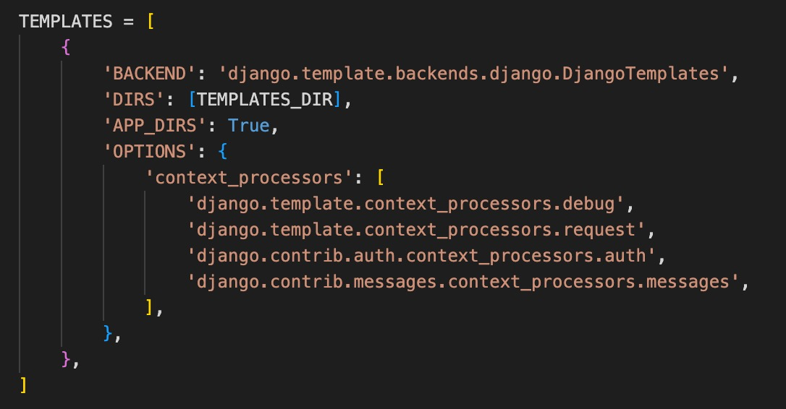
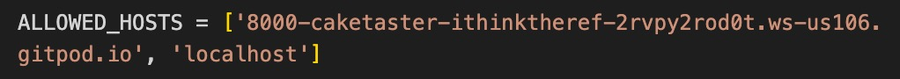

20. Go to settings in Heroku and perform a manual deployment and check for any issues.
21. In Heroku settings, enable automatic deployments.

# Credits
- The header/navbar was edited from [Bootstrap documentation examples](https://getbootstrap.com/docs/5.3/examples/headers/)
- The footer was edited from [Bootstrap documentation examples](https://getbootstrap.com/docs/5.3/examples/footers/)
- The 'favourite' icon came from [Font Awesome](https://fontawesome.com/icons/whiskey-glass?f=classic&s=solid)
- The site icon came from [Flat Icon](https://www.flaticon.com/free-icons/)
- The site banner was designed by me on [Canva](https://www.canva.com)
- The person walking icon was taken and edited from [Bootstrap Icons](https://icons.getbootstrap.com/)
- All cocktail images were taken and cropped from Google Images 
 
- The Code Institute 'I Think Therefore I Blog' project provided the basic framework for my site. 
// need to add - attribution for tutorials + find other things I used

## Media
- The cocktail ingredients and instructions were taken from [the MyBar app](https://mybarapp.com)
- Cocktail descriptions were borrowed and edited from [Spruce Eats](https://www.thespruceeats.com) (Rusty Nail, Sazerac), [Liquor.com](https://www.liquor.com) (Godfather, Old Fashioned), [Cocktail Wave](https://www.cocktailwave.com) (Bobby Burns)
// more to add - whiskey sour, penicillin, blood and sand

# Acknowledgements

// to add in to Credits:
Tutorials and videos I used for:
django forms
update
delete
